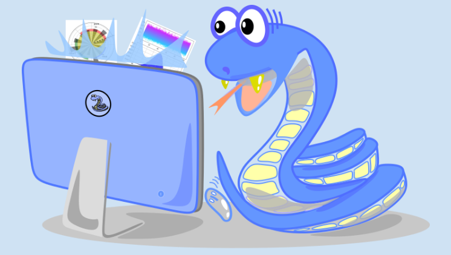

# 이 저장소는 "생능 출판사"의 "따라하며 배우는 파이썬과 데이터 과학(2020 출판)" 저장소입니다.
## 프로그램 코드와 자료를 제공합니다.

안녕하세요 독자여러분 이곳은 이 책의 소스코드와 주피터 노트북 파일, colab 주소, 정오표등 다양한 자료와 정보를 업로드할 예정입니다.

"따라하며 배우는 파이썬과 데이터 과학(2020 출판)"은 파이썬을 처음 배우는 입문자와 데이터과학을 처음 접하는 독자님을 위한 알찬 정보를 제공하고 있습니다.

이 책은 다음과 같은 특징이 있습니다.

#### 첫째, 프로그래밍을 처음 시작하는 당신도 따라하다 보면 데이터 과학과 정보 시각화 전문가가 될 수 있도록 돕는 알찬 내용으로 구성되어 있습니다.
#### 둘째, 데이터 과학에 필수적인 도구인 numpy, pandas, matplotlib, sckit-learn을 다룹니다.
#### 셋째, opencv로 이미지 처리기법을 익힐 수 있습니다.
#### 넷째, 구글의 최신 텐서플로 2.x로 익히는 기계학습, 딥러닝 학습법을 담고 있습니다.
#### 다섯째, 저자의 무료 유튜브 강의가 제공됩니다.

<p align="center">
  
</p>

***
# 책의 목차
* [목차](https://github.com/dongupak/DataSciPy/blob/master/contents.md)
: "따라하며 배우는 파이썬과 데이터 과학" 책의 목차를 제공합니다.

# 책의 오류 및 오탈자
* [오류](https://github.com/dongupak/DataSciPy/blob/master/errata-ver1.md)
: "따라하며 배우는 파이썬과 데이터 과학" 책의 오탈자 목록을 제공합니다.
책의 오류는 다음 이메일로 알려주십시오.
```
dongupak@gmail.com
```

# 강의 계획서
* [강의계획서](https://github.com/dongupak/DataSciPy/blob/master/syllabus.md)
: "따라하며 배우는 파이썬과 데이터 과학" 책을 이용하여 강의를 하시는 강사님을 위한 16주차 강의 계획서 예시

### 사전 지식

이 저장소의 코드를 실행하기 위해서는 다음 웹 사이트에 접속하여 파이썬 IDLE를 다운받아 설치하여야 합니다.
```
https://www.python.org/
```
혹은 다음의 구글 colab 웹사이트에 접속하여(구글 계정이 필요함) 노트북 환경에서 파이썬 코딩을 할 수 있습니다.
```
https://colab.research.google.com/
```

# 책의 LAB과 연습문제 정답지 제공에 관하여

이 책에는 많은 LAB문제와 연습문제가 제공됩니다. 저자들이 모든 문제에 대해 답을 만들어 보았지만, 이것은 문제의 유효성을 검증하기 위한 것일 뿐입니다.  
LAB과 연습문제는 답이 제시되지 않은 문제의 해답을 찾는 과정과 실습을 통해 더 깊은 학습을 할 수 있도록 준비된 것입니다.
이에 저자는 정답지 제공을 하지 않습니다.
