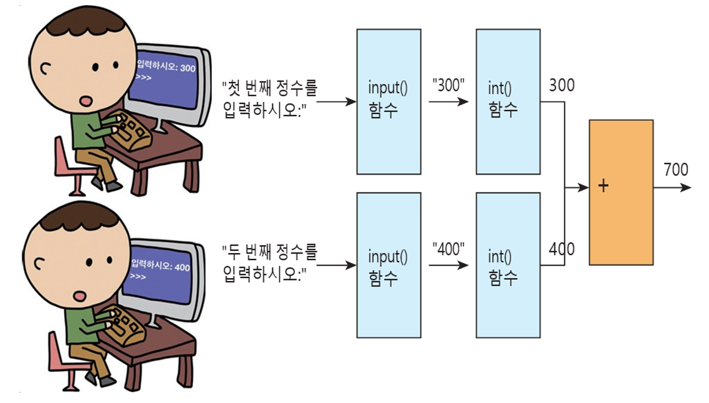
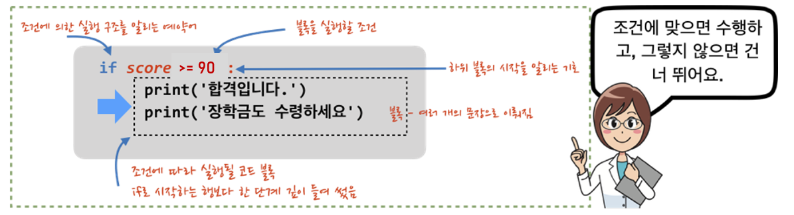
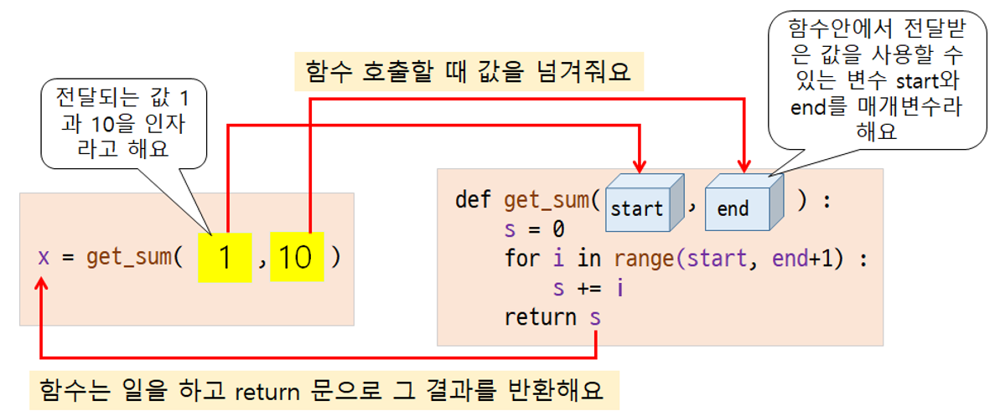

# "따라하며 배우는 파이썬과 데이터 과학" 정오표
## *책 내용에 있는 오류를 정리한 페이지 입니다. 불편을 끼쳐드려 대단히 죄송합니다. 다음 인쇄 때 수정하여 반영하겠습니다.*
## *책 증보판 발행시 소중한 기여자 분들의 id를 표기하여 감사의 마음을 표시하고자 합니다*
---

# 오류
## 잘못된 코드 오류, 실행 결과 오류, 잘못된 설명, 잘못된 참조 번호(그림, 코드 등) 

## 페이지 : 49쪽
### 오류 내용 : 원기둥의 부피를 계산하는 식 오류
<pre>
volume_of_cylinder = pi * radius * height
</pre>
* 수정 후
<pre>
volume_of_cylinder = pi * (radius ** 2) * height
</pre>

## 페이지 : 62쪽
### 오류 내용 : 그림의 오른쪽 input()은 int()의 오타
<pre>
input()
</pre>
* 수정 후
<pre>
int()
</pre>

  

## 페이지 : 72쪽
### 오류 내용 : 표의 지수 결과값에서 72가 아닌 7의 2승입니다.
<pre>
72 = 49
</pre>
* 수정 후
<pre>
7^2 = 49
</pre>

## 페이지 : 86쪽
### 오류 내용 : random.randrange()의 주석 수정
<pre>
>>> random.randrange(0, 10, 2)  # 0, 2, 4, 8 중(10은 포함 안함) 하나를 반환함
</pre>
* 수정 후
<pre>
>>> random.randrange(0, 10, 2)  # 0, 2, 4, 6, 8 중(10은 포함 안함) 하나를 반환함
</pre>

## 페이지 : 88쪽
### 오류 내용 : 9의 제곱근 오류
<pre>
9의 제곱근 = 2.8284271247461903
</pre>
* 수정 후
<pre>
9의 제곱근 = 3
</pre>

## 페이지 : 90쪽
### 오류 내용 : 3.12 문제 오류
<pre>
3.12 다음과 같은 공식을 참고하여 입체도형의 부피를 구하는 함수를 만드시오.
</pre>
* 수정 후
<pre>
3.12 다음과 같은 공식을 참고하여 입체도형의 부피를 구하여 출력하시오.
</pre>

## 페이지 : 95쪽
### 오류 내용 : 그림의 if문에서 score가 90점 이상이면 출력을 하므로 score >= 90이 맞습니다
<pre>
if score > 90:
</pre>
* 수정 후
<pre>
if score >= 90:
</pre>

  

## 페이지 : 96쪽
### 오류 내용 : 그림의 if문에서 score가 60점 이상이면 출력을 하므로 score >= 60이 맞습니다
<pre>
if score > 90:
</pre>
* 수정 후
<pre>
if score >= 60:
</pre>

## 페이지 : 151쪽
### 오류 내용 : 첫번째 그림 오른쪽에서 내부의 for문에서 s += i가 s += 1로 잘못 표기됨
<pre>
s += 1
</pre>
* 수정 후
<pre>
s += i
</pre>

  

## 페이지 : 209쪽
### 오류 내용 : 대칭차집합 메소드의 이름은 symmetric_difference() 입니다.
<pre>
대칭차집합은 ^ 연산자나 symmetry_difference() 메소드를 사용한다.
</pre>
* 수정 후
<pre>
대칭차집합은 ^ 연산자나 symmetric_difference() 메소드를 사용한다.
</pre>

<pre>
>>> A.symmetry_difference(B)
</pre>
* 수정 후
<pre>
>>> A.symmetric_difference(B)
</pre>

## 페이지 : 257쪽
### 오류 내용 : 아래에서 부터 두번째 코딩 블록에서 주석문의 오류
<pre>
>>> scores[1:4] # 첫 번째, 두 번째, 세 번째, 네 번째 항목을 슬라이싱 함
</pre>
* 수정 후
<pre>
>>> scores[1:4] # 두 번째, 세 번째, 네 번째 항목을 슬라이싱 함
</pre>

## 페이지 : 262쪽
### 오류 내용 : 첫번째 코딩 블록에서 np_array > 5 의 결과가 일부 생략
<pre>
>>> np_array > 5
array([[False, False, False],
</pre>
* 수정 후
<pre>
>>> np_array > 5
array([[False, False, False],
       [False, False, True],
       [True, True, True]])
</pre>

## 페이지 : 263쪽
### 오류내용 : 두번째 문장의 오류
<pre>
그리고 다음과 같은 두 개의 2차원 배열에 정수를 담아 두 배열을 더해서 결과를 확인해 보라.
</pre>
* 수정 후
<pre>
그리고 다음과 같은 두 개의 2차원 배열에 정수를 담아 두 배열의 뺄셈을 해서 결과를 확인해 보라.
</pre>

## 페이지 : 264쪽
### 오류 내용 : BMI결과 값 오류
- BMI = 몸무게 / 키 ** 2이므로 bmi = x[1] / x[0] ** 2으로 표현해야 함
- 따라서 결과 값도 달라짐

## 페이지 : 274쪽
### 오류 내용 : 세번째 문장의 corrcoeff 오타
<pre>
corrcoeff(x, y) 함수는
</pre>
* 수정 후
<pre>
corrcoef(x, y) 함수는
</pre>

## 페이지 : 279쪽
### 오류 내용 : 연습문제 10.5의 코드 오류, 32개의 값을 생성해야 하므로 arange()의 인자가 24가 아닌 32임
<pre>
a = np.arange(0, 24).range(4, 4, 2)
</pre>
* 수정 후
<pre>
a = np.arange(0, 32).range(4, 4, 2)
</pre>

## 페이지 : 288쪽
### 오류 내용 : x, y, z를 plotting하는 함수에서 세번째 함수의 인자에서 오타
<pre>
plt.plot(x, y, label='qubic')
</pre>
* 수정 후
<pre>
plt.plot(x, z, label='cubic')
</pre>

## 페이지 : 310쪽
### 오류 내용 : 울릉도 지역의 최대 풍속을 구하기 때문에 row[3]은 row[2]로 수정할 것
- 결과 값도 14.9 m/s에서 26.0 m/s가 됨

## 페이지 : 320쪽
### 오류 내용 : "잠깐" 섹션의 마지막 줄에서 편항은 편향의 오타로 수정할 것

## 페이지 : 345쪽 네번째 문장
### 오류 내용 : 300400의 크기로 -> 300x400의 크기로

## 페이지 : 349쪽 두번째 문장
### 오류 내용 : 푸른색 픽셀만을 골라내어 수 있다. -> 푸른색 픽셀만을 골라낼 수 있다.

## 페이지 : 372 쪽
### 오류 내용 : 두번째 문단 아래의 수식표기 오류 
<pre>
y = ma + b
</pre>
* 수정 후
<pre>
y = mx + b
</pre>

### 오류 내용 : 네번째 문단 마지막 문장의 표기 오류
<pre>
최소 제곱 오차(MSE) 오차와 같은 방식으로 오차를 얻는 척도이다
</pre>
* 수정 후
<pre>
평균 제곱 오차(MSE)와 같은 방식으로 오차를 얻는 척도이다
</pre>

## 페이지 : 383 쪽
### 오류 내용 : 두 번째 문단 마지막 줄 오류
<pre>
최소
</pre>
* 수정 후
<pre>
y = mx + b
</pre>

## 페이지 : 399쪽
### 오류 내용 : 심화문제 14.3의 표의 내용 오류, 닥스훈트의 높이 데이터가 잘못됨

| 닥스훈트 |    |    |    |    |    |    |    |   |
|:------:|:--:|:--:|:--:|:--:|:--:|:--:|:--:|:--:|
|  길이  | 77 | 78 | 85 | 83 | 73 | 77 | 73 | 80
|  높이  | 56 | 57 | 50 | 53 | 60 | 53 | 49 | 61
* 수정 후

| 닥스훈트 |    |    |    |    |    |    |    |   |
|:-------:|:--:|:--:|:--:|:--:|:--:|:--:|:--:|:--:|
|   길이   | 77 | 78 | 85 | 83 | 73 | 77 | 73 | 80
|   높이   | 25 | 28 | 19 | 30 | 21 | 22 | 17 | 35

## 페이지 : 400쪽
### 오류내용 : 심화문제 14.3, 2)의 데이터 누락, E가 빠짐
<pre>
A : 길이 45, 높이 34
B : 길이 70, 높이 59
C : 길이 49, 높이 30
D : 길이 60, 높이 56
</pre>
* 수정 후
<pre>
A : 길이 45, 높이 34
B : 길이 70, 높이 59
C : 길이 49, 높이 30
D : 길이 60, 높이 56
E : 길이 80, 높이 41
</pre>

# 오탈자
## 단순 오자와 탈자를 알려드립니다.

## 페이지 : 290쪽
### 오류내용 : 코드 내부의 레이블를 -> 레이블을의 오자
<pre>
# y축에 레이블를 붙인다.
</pre>
* 수정 후
<pre>
# y축에 레이블을 붙인다.
</pre>

## 페이지 : 174쪽, 마지막 문장
### 오류내용 : bst -> bts 오자
<pre>
예를 들어 V가 bst의 ...
</pre>
* 수정 후
<pre>
예를 들어 V가 bts의 ...
</pre>
