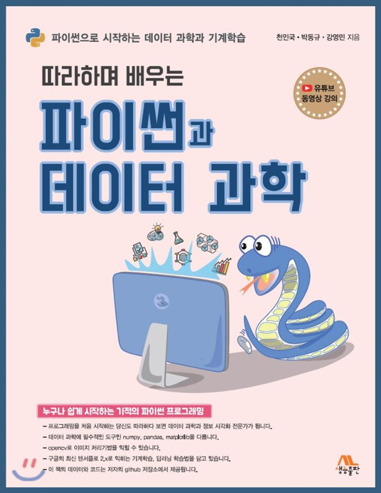

## "따라하며 배우는 파이썬과 데이터 과학" 강의 계획서 예시

  

## 강의 교재 
- "따라하며 배우는 파이썬과 데이터 과학"(생능출판사, 2020년 출판)
- 저자 : 천인국, 박동규, 강영민
- 교재의 특징 :데이터를 바탕으로 과학적인 분석을 통해 의사결정을 내리기 위한 학문인 데이터 과학을 위한 깊이 있는 이론과 프로그래밍 코드가 제공되며, 풍부한 연습문제를 통해 실전에 필요한 실력을 향상할 수 있다.

## 강의 소개
- 본 강의는 파이썬 프로그래밍을 통해서 수강생들의 데이터 과학적 사고능력을 향상하는 것을 목표로 한다.
- 기초적인 파이썬 개발도구의 설치에서부터 출력문, 제어문, 함수의 개념을 익혀서 컴퓨터를 이용한 많은 문제해결을 해 보도록 한다.
- 이를 통해서 효율적인 데이터 과학을 위한 시각화 방법을 익혀서 여러 가지 문제 해결을 할 수 있다.
- 또한 기계학습을 위한 scikit-learn, tensorflow 프로그래밍을 익히도록 한다.

## 강의 목표
- 데이터 과학을 위하여 파이썬 프로그래밍 언어를 이용하여 문제해결 코딩을 할 수 있다.
- 다양한 데이터를 처리하기 위하여 파이썬의 리스트, 튜플, 딕셔너리 등의 자료형 객체를 활용할 수 있다.
- 데이터 과학에 필요한 넘파이, OpenCV, matplotlib, scikit-learn, tensorflow 등의 도구를 익힌다.

## 플립드 러닝(뒤집힌 학습) 진행시
- 주차별 계획에 따라 강사의 동영상 강의 혹은, 아래 “따라하며 배우는 파이썬과 데이터 과학” 동영상 강의를 미리 듣고,  각 절의 LAB 문제와 각 장의 주요 연습문제를 강사와 함께 풀어봅니다.(문제 풀이 포함 전체 47개 가량의 학습 동영상으로 구성)
- 문제를 풀면서 해결이 안될 경우 동료 학습자와 토의하며 함께 해결해 봅니다. 해결 후 강사와 함께 문제에 대하여 토의하고 더 난이도 높은 문제에 도전해 봅니다.
- 문제 해결 후 동영상 강의를 다시 한번 듣고 복습해 봅니다.
   - https://www.youtube.com/playlist?list=PL2P1Vm9k53HOD_lesbnzAS51t71QeOPms

# 주별 계획
## 1주 : 강의소개
- 강사소개, 교재 소개로 시작하도록 한다.
- "데이터 과학과 파이썬의 세계로"라는 주제로 데이터에 근거하여 과학적 방법을 통해 합리적인 의사결정의 기본이 되는 데이터 과학을 소개한다.
- 파이썬 개발도구 설치와 print() 함수를 이용한 출력을 알아본다.

## 2주 : 변수와 식별자, 연산자
- 데이터를 저장하기 위한 공간인 변수에 대하여 알아보고 변수와 식별자, 키워드를 구분해 본다.
- 문자열과 수식, 할당연산에 대하여 알아본다.
- 복합할당 연산자와 논리연산자, 비트 연산자를 이해한다.

## 3주 : 조건문
- 프로그래밍을 위한 3가지 기본제어 구조를 이해한다.
- 파이썬의 블럭개념과 들여쓰기의 중요성을 이해한다
- if, if-else, if-elif-else문을 이용한 문제해결 기법을 알아본다.

## 4주 : 반복문
- 반복문의 중요성을 알아보고 for문과 while문의 차이점을 이해한다.
- 반복문을 이용한 여러가지 문제해결 기법을 알아본다.

## 5주 : 함수
- 함수의 작성 필요성과 모듈화 프로그래밍의 중요성을 이해한다.
- 함수의 인자와 매개변수, 반환값을 이용한 문제해결 기법을 이해한다.
- 디폴트 인자와 키워드 인자를 이용한 함수 호출기법을 알아본다.

## 6주 : 리스트와 튜플
- 자료값을 여러개 묶어주는 리스트와 튜플의 편의성과 차이점을 이해한다
- 자료값에 접근하는 인덱싱과 슬라이싱, 메소드를 알아본다.
- 리스트 축약표현으로 효율적인 코딩방법을 익힌다.

## 7주 : 딕셔너리와 집합
- 키와 값을 가진 딕셔너리 자료형과 순서가 없는 자료 값의 모임인 집합
자료형을 알아본다.
- 두 자료형에서 사용가능한 고급 메소드를 알아본다.

## 8주 : 텍스트를 처리하는 방법
- 문자열과 split() 메소드등 다양한 메소드를 알아본다.
- 정규표현식을 이용한 문자열의 추출과 대체 기능을 알아본다.

## 9주 : 넘파이
- 넘파이와 리스트의 차이점을 알아본다.
- ndarray 객체의 속성과 배열 연산을 알아본다.
- arange()를 이용한 데이터 생성기법과 난수에 대하여 살펴본다.
- 데이터 간의 상관관계를 구하는 방법을 알아본다.

## 10주 : 데이터 시각화
- 정보 시각화의 중요성을 이해한다.
- 수치 데이터를 손쉽게 시각화 하는 맷플롯립의 기능을 알아본다.
- 히스토그램, 산포도, 파이차트 등의 다양한 차트를 생성하는 방법을 알아본다.

## 11주 : 판다스
- csv 데이터의 형식과 데이터 추출 방법을 익힌다
- 그룹핑과 필터링, 결측값을 찾는 방법을 알아본다.
- 데이터베이스의 자료를 합치는 join() 기능을 알아본다.

## 12주 : OpenCV 이미지 처리
- 이미지 데이터의 형식과 시각화 기법을 익힌다.
- 필터링과 색상 추출방법을 익힌다.
- 윤곽선을 추출하고 이미지를 합성한다.

## 13주 : 기계학습
- 다양한 기계학습 방법이 있음을 이해한다.
- 선형회귀를 통해 데이터를 통해 학습을 시키고 모델을 만들어 예측 값을 얻는 방법을 익힌다.
- k-NN 알고리즘과 다양한 학습방법, 분류기에 대하여 알아본다.

## 14주 : 텐서플로 
- 인간의 신경세포 구조와 인공신경망의 차이를 이해한다.
- 패션 MNIST 데이터를 이용하여 지도학습의 개념을 익힌다.
- 이미지를 인식시키는 모델을 만들고 실제 이미지를 적용하여 정확도를 높이는 방법을 살펴본다.

## 15주 : 학기말 텀 프로젝트 혹은 기말평가
